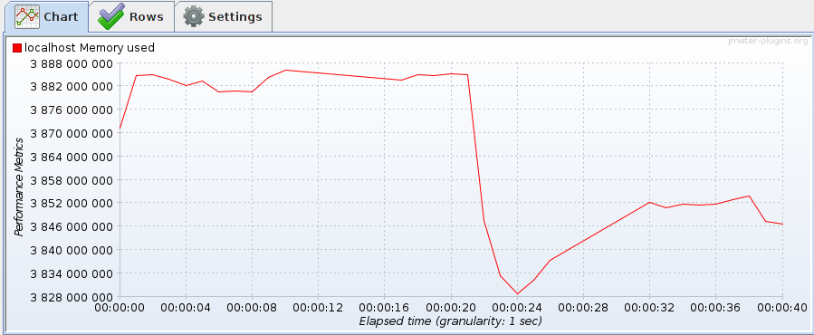

# Mengimplementasikan dan Mengukur Kinerja Web Server
### By :
##### Faza Thirafi 13514057
##### Cut Meurah Rudi 13514057

[](https://nodesource.com/products/nsolid)

#### Daftar isi dari laporan ini meliputi :
  - Pengenalan Tools Benchmark
  - Perbandingan performa server Nginx dan Apache2
  - Performa event based server menggunakan libev


### A. Pengenalan Tools Benchmark

##### `Jmeter` - Software Open Source yang 100% dikembangkan dengan bahasa Java untuk menghitung performa web server

Untuk menghitung waktu respons rata-rata dan memory usage dari CPU kami menggunakan aplikasi Jmeter ini. Jmeter dapat melakukan concurrent request dengan membentuk multiple thread yang melakukan request yang sama ke sebuah server yang telah ditentukan host dan portnya. Kemudian Jmeter memiliki listener `Response Time Graph` yang dapat digunakan untuk menghitung waktu rata-rata untuk yang dibutuhkan untuk menerima respons setelah mengirim sebuah request

Sedangkan untuk menghitung load memory akibat concurrent request yang dilakukan. Jmeter menyediakan plugin bernama `ServerAgent`. ServerAgent ini dapat ditempatkan di host tempat kinjerja memori yang akan diukur kemudian kita dapat menentukan port yang digunakan oleh ServerAgent tersebut untuk berkomunikasi. Untuk melakukan monitoring secara remote dari host, Jmeter memiliki plugin `PerfMon` yang digunakan untuk mengambil metriks data yang telah dikumpulkan oleh ServerAgent kemudian menampilkannya dalam bentuk graph.

##### Cara Melakukan Test
- Kami membuat sebuah API yang menerima masukan parameter. Parameter yang diterima adalah size dari file yang diminta, yaitu 500 byte atau 20 Kilobyte. 
- Jmeter akan menggunakan `Thread Manager` untuk membuat multiple thread, kemudian melakukan request melalui sampler `HTTP Request` yang dimiliki Jmeter. Penggunaan Thread Manager untuk melakukan concurrent request
- Mengaktifkan server yang akan dilakukan test, Nginx atau Apache2 pada Port 80
- Mengaktifkan ServerAgent di host pada Port 4444
- Buka file `test_plan.jmx` menggunakan Jmeter


### B. Pemakaian Server
Sebelum menjalankan server, kita  compile terlebih dahulu server, lalu kita jalankan melalui terminal (diarahkan ke tempat source code dan `Makefile` berada)
```sh
$ make clean
$ make
$ make run
```
Lalu, pada browser yang kita buka, buat request yang akan memunculkan file html yang berada pada server
```sh
localhost:3033
```
Maka dengan url tersebut, server akan mengirimkan response berupa file html yang ditampilkan oleh browser.

### C. Perbandingan Performa Server Nginx dan Apache2
##### Response time rata-rata dari server Nginx
- ###### Untuk Response File 500 byte

- ###### Untuk Response File 20 kilobyte


##### Response time rata-rata dari server Apache2
- ###### Untuk Response File 500 byte

- ###### Untuk Response File 20 kilobyte


##### Memory usage dari server Nginx
- ###### Untuk Response File 500 byte

- ###### Untuk Response File 20 kilobyte


##### Memory usage dari server Apache2
- ###### Untuk Response File 500 byte

- ###### Untuk Response File 20 kilobyte


### D. Performa Event Based Server Menggunakan Libev
##### Response time rata-rata server
- ###### Untuk Response File 500 byte

- ###### Untuk Response File 20 kilobyte


##### Memory usage server
- ###### Untuk Response File 500 byte

- ###### Untuk Response File 20 kilobyte


